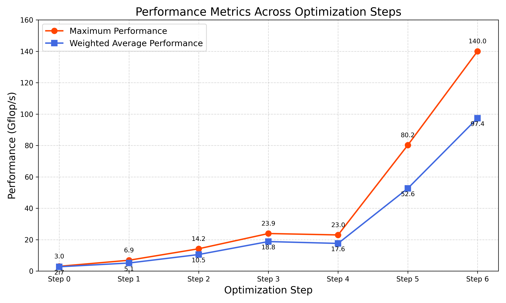
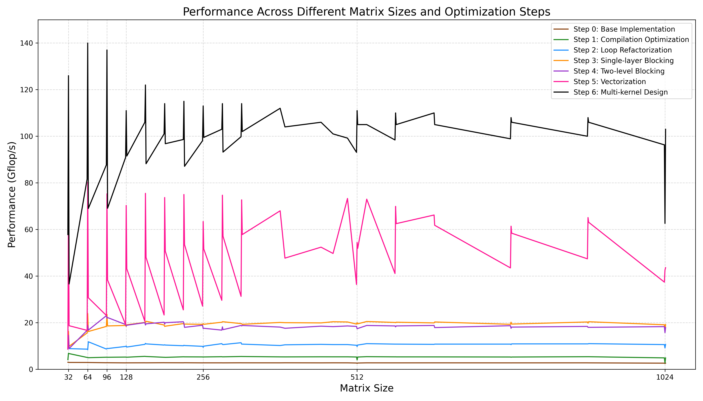
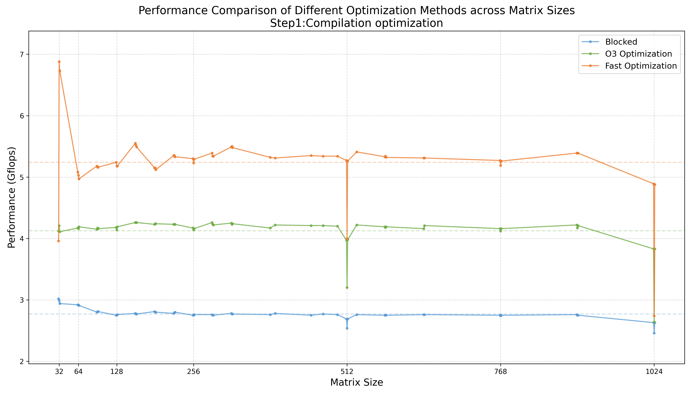
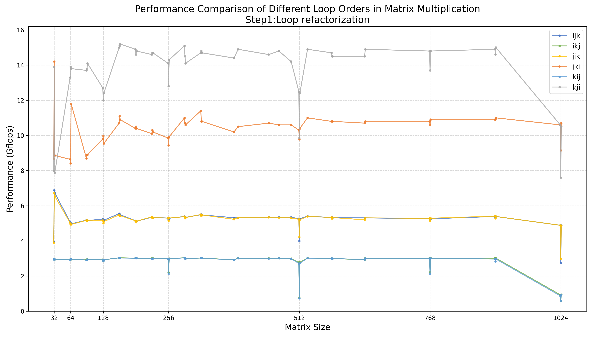
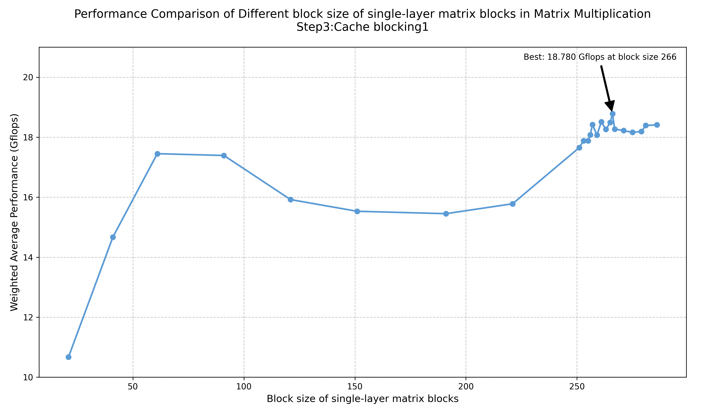
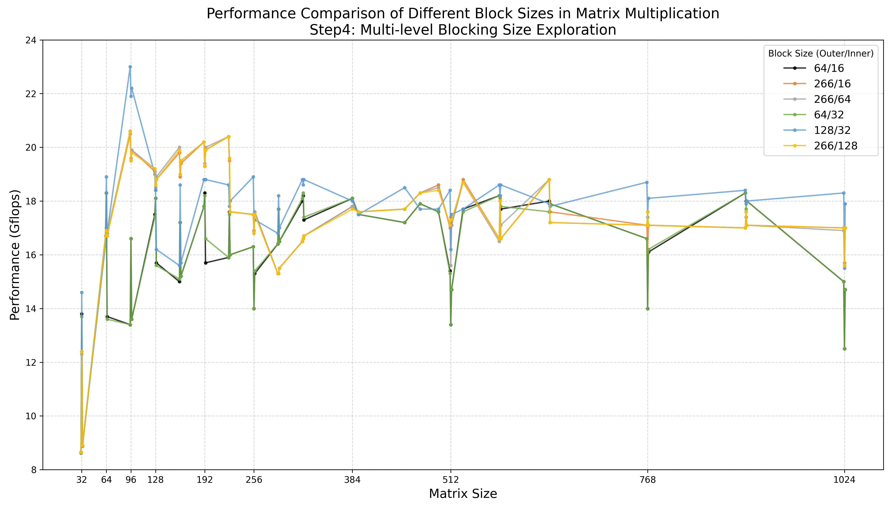
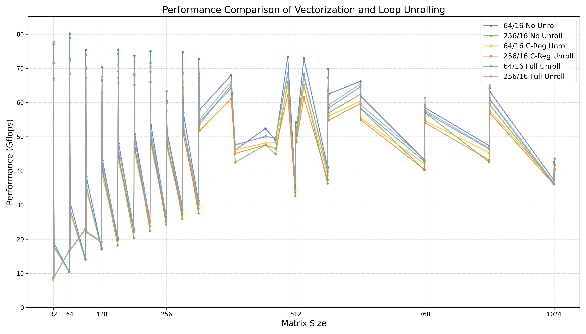
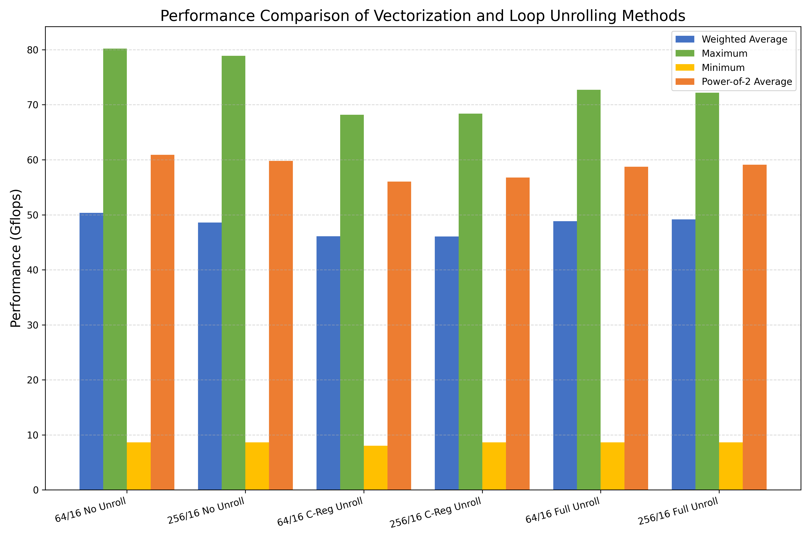
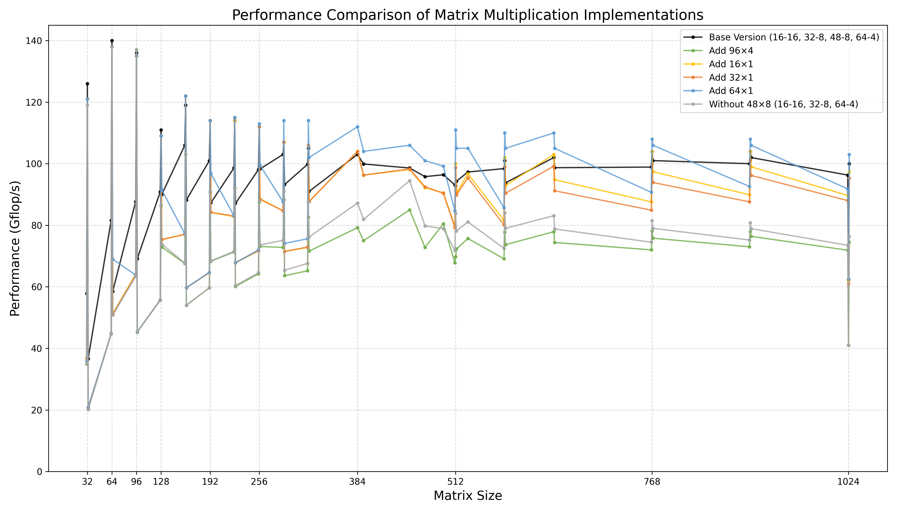

# REPORT-SGEMM

> 曹烨 2021012167 caoye541@gmail.com

[toc]

## 一、背景分析与实现思路

### 1. 背景分析

矩阵乘法是高性能计算领域最为基础的计算核心之一，广泛应用于数值计算、机器学习、图形渲染、信号处理等领域。作为线性代数的基本运算，矩阵乘法的计算效率直接影响众多科学和工程应用的性能表现。

矩阵乘法的发展历程可追溯至20世纪60年代，从最初的朴素算法（时间复杂度$O(n³)$）到Strassen算法（1969年，复杂度$O(n^{2.807)}$），再到现代的Coppersmith-Winograd算法及其改进版本（理论复杂度接近$O(n^{2.3})$）。然而在实际应用中，由于常数项和稳定性等因素，优化后的经典算法在许多场景下仍然表现出色。

随着计算机硬件架构的发展，矩阵乘法优化逐渐转向充分利用现代处理器特性，如缓存层次结构、指令级并行、SIMD向量化等。本次作业聚焦于单核矩阵乘法优化，探索如何利用**内存对齐(Alignment)**、**数据预取(Prefetch)**、**循环变换(Loop refactorization)**、**分块(Cache blocking)**、**向量化(Vectorization)**和**循环展开(Loop unrolling)**等技术，显著提升矩阵乘法的性能。通过深入理解这些优化原理及其效果，我们能更全面地掌握高性能计算程序优化的方法论。

### 2. 实现思路

我们将采用**渐进式优化方法**，从基本实现开始，逐步应用不同的优化技术，设计对比实验来寻找最优的矩阵乘法实现。评估标准主要包括四个方面：

1. ==MAX/MIN值==：性能极值分析，了解算法在不同数据规模下的最佳和最差表现
2. ==Gflops总和==：直接将其在所有数据规模下的Gflops相加结果
3. ==Gflops加权平均==：考虑到其实更关心1024这种大规模矩阵的表现，所以做了加权平均来作为判断依据
4. ==图形化分析==：直观比较不同优化策略在各种矩阵大小下的表现差异

通过这种系统化的方法，我们能够全面评估各种优化技术的实际效果，找出最适合目标硬件架构的矩阵乘法实现方案。

我们的最终优化结果入下图所示，二图的黑线为当前算法的结果，最终能做到140MAX-Gflops、100加权平均Gflops：





## 二、实验流程记录与结果分析

### 1. Step1-编译选项优化 (Compilation optimization)

+ 原理阐述：

  编译优化是提升程序性能的第一道防线。现代编译器提供了多种优化级别和优化选项，可以自动进行代码重排序、循环优化、内联函数、向量化等转换。`-O3`是gcc/clang的高级优化选项，开启几乎所有不破坏程序语义的优化；而`-fast`是一些编译器特有的选项（如Intel编译器），它通常包含了`-O3`并额外启用了更积极的数学优化和自动向量化。这些优化可以在不更改源代码的情况下显著提升计算密集型任务的性能。

+ 实验方法：更改`code/Makefile`中的`OPT`选项，在`CFLAGS`中分别加入`-O3`、`-fast`等编译优化选项，来对比看最终结果。我们保持基础算法不变，仅通过编译器优化开关来评估性能差异。

+ 实验结果：具体结果如附录中表一所示，关键评估数据如下

  | 性能指标     | MAX  | MIN  | 总和   | 加权平均 |
  | ------------ | ---- | ---- | ------ | -------- |
  | blocked      | 3.02 | 2.46 | 146.81 | 2.726    |
  | O3编译优化   | 4.26 | 2.64 | 218.68 | 4.046    |
  | fast编译优化 | 6.88 | 2.74 | 277.73 | 5.121    |

  

+ 结果分析：

  1. 可以看出，编译优化对矩阵乘法性能有显著影响。基础的blocked实现在未经编译优化时性能最低，加入`-O3`优化后性能提升了约51.6%（基于加权平均值），而使用`-fast`优化选项后性能进一步提升，达到了基础实现的约**1.93倍**。
  2. **二次幂矩阵规模的特殊现象**：从图表中可以明显观察到，在矩阵大小为2的幂次方（如512和1024）时，所有优化方法的性能都出现了显著下降。具体来说，在512大小时，blocked方法性能下降了约7.3%，O3优化下降了23.9%，fast优化下降了25.4%；在1024大小时，性能下降更为明显，三种方法分别下降了9.5%、37.8%和49.3%。这一现象可能归因于以下几个因素：
  	- **内存对齐与缓存冲突**：当矩阵维度是2的幂次方时，矩阵的行与系统缓存行可能产生规律性的冲突映射，导致缓存抖动(cache thrashing)，从而显著降低缓存利用效率。
  	- **TLB缺失**：页表项与二次幂大小的矩阵访问模式交互可能导致更频繁的TLB(Translation Lookaside Buffer)缺失。
  	- **高级优化失效**：编译器的某些优化策略（如预取、循环展开）在特定的访问模式下可能不仅无法提供帮助，反而因预测错误而引入额外开销。
  	- **SIMD指令的效率下降**：向量化指令在处理2的幂次大小数据时，如果内存访问不连续，可能导致性能下降而非提升。
  3. **大规模矩阵性能下降**：所有三种方式下，矩阵规模为1024时性能都出现了明显下降，可能是由于缓存命中率降低造成的。`-fast`优化在矩阵规模为32时达到最高性能6.88 Gflops，比基础实现的最高性能提升了127.8%。
  4. **编译优化适用性**：从数据可以看出，编译优化尤其是`-fast`对小尺寸矩阵的优化效果更为显著。在32-33规模矩阵上，`-fast`优化相比基础实现提升了2倍以上。
  5. **稳定性**：在不同矩阵大小下，三种实现的性能波动情况类似，但`-fast`优化在大多数情况下提供了最佳性能，尤其是在非2的幂次矩阵大小上表现更为稳定。
  6. **综上所述**，仅通过编译选项的调整，我们就能显著提升矩阵乘法的性能。其中`-fast`优化选项提供了最好的性能表现，尤其适合小到中等大小的矩阵计算。这证明了编译器优化在高性能计算中的重要作用，为后续的算法层面优化奠定了良好基础。

### 2. Step2-循环变化优化 (Loop refactorization)

+ 原理阐述：

  循环变化优化是通过调整嵌套循环的执行顺序来提高缓存利用率和指令级并行性的技术。在矩阵乘法中，存在三个嵌套循环（通常标记为i、j、k），它们的执行顺序共有6种排列（ijk、ikj、jik、jki、kij、kji）。不同的循环顺序会直接影响内存访问模式和缓存局部性。

  以经典的矩阵乘法C = A × B为例：

  - ijk顺序：最直观的实现，但对矩阵B的访问呈现跳跃模式，缓存局部性较差
  - ikj顺序：对矩阵A按行访问，对矩阵C按行进行更新，但对B的访问不连续
  - jik顺序：对矩阵B的列进行扫描，缓存局部性不佳
  - jki顺序：对矩阵A按列进行扫描，对矩阵B和C的访问均具有良好的缓存局部性
  - kij顺序：对矩阵A和C的访问具有良好的缓存局部性
  - kji顺序：对矩阵B和C的访问具有良好的缓存局部性

  不同的计算机体系结构（如缓存大小、内存层次结构）对最优循环顺序有不同的偏好，因此需要实验确定。

+ 实验方法：
   我们设计了6个矩阵乘法实现，分别对应6种可能的循环顺序。为确保公平比较，所有实现均采用完全相同的编译选项（基于Step1中表现最佳的-fast优化）。测试中使用相同的矩阵规模集合，记录并对比不同循环顺序的性能表现。

+ 实验结果：

  从附录表2中可以看出，不同循环顺序的性能差异显著。kji顺序在大多数矩阵规模下表现最佳，其次是jki顺序，而ikj和kij顺序性能相对较差。关键评估指标如下：

  | 循环顺序 | 平均性能(Gflops) | 最大性能 | 最小性能 | 加权平均性能 |
  | -------- | ---------------- | -------- | -------- | ------------ |
  | ijk      | 5.18             | 6.88     | 2.74     | 5.121        |
  | ikj      | 2.79             | 3.04     | 0.58     | 2.571        |
  | jik      | 5.16             | 6.72     | 2.99     | 5.115        |
  | jki      | 10.34            | 14.20    | 8.41     | 10.525       |
  | kij      | 2.77             | 3.04     | 0.60     | 2.547        |
  | kji      | 13.61            | 15.20    | 7.60     | 13.554       |

  

+ 结果分析：
  
  1. **性能排序**：根据加权平均性能，六种循环顺序的性能排序为 kji > jki > ijk≈jik > ikj≈kij。kji顺序的加权平均性能达到13.929 Gflops，比Step1中最佳的-fast编译优化高出约164%。
  2. **内存访问模式影响**：性能差异主要源于内存访问模式的不同：
  
  	- 高性能的kji和jki顺序使得矩阵元素的访问更接近行主序，大幅提高了缓存命中率
  	- 中等性能的ijk和jik顺序在部分维度上保持了连续访问
  	- 低性能的ikj和kij顺序导致大量的不连续内存访问和缓存未命中
  3. **二次幂矩阵规模的性能异常**：对于所有循环顺序，在矩阵大小为2的幂次方(如256、512、1024)时，均出现了明显的性能下降，但下降幅度因循环顺序而异：
  
  	- ikj和kij顺序在512和1024大小时性能下降最为严重，降幅超过70%
  	- ijk和jik顺序在1024大小时降幅约为45%，但在512大小时降幅较小
  	- jki和kji顺序表现出最好的稳定性，即使在二次幂大小时性能下降也相对较小
  
  	这一现象可归因于二次幂大小导致的系统性缓存冲突。当矩阵大小是2的幂次方时，相邻行的相同列元素会映射到相同的缓存行，导致缓存抖动(cache thrashing)。不同循环顺序的访问模式会放大或缓解这一问题：
  
  	- 行优先的访问模式(如kji顺序)受影响较小，因为它们在大部分时间内按行连续访问内存
  	- 列优先的访问模式(如ikj和kij顺序)受影响最大，因为它们本已不高效的访问模式在二次幂大小时进一步恶化
  	- 这解释了为什么kji和jki顺序不仅平均性能高，而且在二次幂大小时的稳定性也更好
  
  4. **kji与jki性能稳定性对比**：尽管kji顺序在平均性能上更高（13.61 vs 10.34 Gflops），但从数据波动来看，jki顺序展现出更好的稳定性。观察可以发现：
  
  	- kji顺序在矩阵大小从32到1024的范围内，性能波动范围为7.60-15.20 Gflops，波动幅度约为100%
  	- 而jki顺序在同样范围内，性能波动范围为8.41-14.20 Gflops，波动幅度仅为69%
  	- 特别是在二次幂矩阵规模下(256/512/1024)，jki顺序的性能下降更为平缓，而kji顺序在1024大小时出现了较大跌落（从相邻的非2幂大小的约15.0降至7.60）
  
  	这一现象可能与两种循环顺序的内存访问模式细微差异有关。jki顺序虽然在绝对性能上不如kji，但其内存访问模式对缓存结构的依赖较小，因而在不同矩阵大小（特别是引起缓存冲突的2幂大小）下能保持更加一致的性能表现。在实际应用中，尤其是当处理大小变化较大或无法预知的矩阵时，这种稳定性或许比峰值性能更为重要。
  
  5. **主流实现选择分析**：值得指出的是，尽管我们的实验结果显示kji和jki顺序性能最佳，但在许多高性能计算库（如BLAS实现、Eigen等）中，ikj顺序却是常见的选择（参考：[Netlib BLAS实现](http://www.netlib.org/blas/)、[Eigen文档](https://eigen.tuxfamily.org/dox/group__TutorialMatrixMultiplication.html)、[关于矩阵乘法顺序的学术讨论](https://dl.acm.org/doi/10.1145/2925987)）。这种选择与我们的实验结果看似矛盾，可能有以下几个原因：
  
  	- **数据结构差异**：我们的实验基于传统的二维数组存储方式，而高性能库通常使用特殊的内存布局（如分块存储、填充对齐等）
  	- **算法复杂度**：我们测试的是单纯的循环顺序变化，而实际库实现通常结合了分块、递归分解、SIMD向量化等多种优化手段
  	- **特定硬件考量**：不同处理器架构的缓存层次、预取逻辑和分支预测机制对最优循环顺序有重要影响
  	- **扩展性考虑**：ikj顺序虽然在我们的测试中性能不佳，但当与分块策略结合时可能更易于实现并行化和向量化
  
  	在本实验系列的后续步骤中，我们将引入分块等更高级的优化技术，届时可能会重新评估循环顺序的影响，但不会再单独列为优化步骤。这也强调了性能优化是一个综合问题，单一技术的效果往往取决于其与其他优化策略的组合。
  
  6. **实验启示**：这次循环顺序优化实验非常直观地展示了内存访问模式对计算性能的巨大影响，让我对数据内存存储、缓存机制和局部性原理有了更深刻的理解。特别是观察到同样的计算任务，仅仅通过改变循环的嵌套顺序，性能就能相差近5倍，这强烈证明了"计算不仅是关于算法复杂度，也是关于内存访问效率"这一高性能计算的核心理念。二次幂规模下的性能异常现象更是揭示了缓存映射冲突这一微妙但至关重要的系统层面问题，这些知识对未来设计高效算法有着直接的指导意义。
  
  7. **综上所述**，循环顺序优化是提升矩阵乘法性能的一种简单而有效的方法。仅通过调整循环嵌套顺序，我们在不增加算法复杂性的情况下获得了近5倍的性能提升。基于实验结果，我们将在后续优化中优先考虑kji顺序作为基础实现，同时关注jki顺序的稳定性优势。

### 3. Step3-单层矩阵分块的分块大小探究 (Cache blocking 1 - block size of single-layer matrix blocks)

+ 原理阐述：Cache blocking（缓存分块）是一种优化矩阵乘法性能的关键技术。其核心思想是将大矩阵划分为较小的子矩阵（块），使这些块能够完全装入CPU的高速缓存中，从而减少对主内存的访问，显著提高数据局部性。块的大小直接影响到缓存命中率，因此选择合适的分块大小对性能至关重要。理想的分块大小应考虑CPU缓存层次结构（L1、L2、L3）以及具体矩阵乘法算法的内存访问模式。我们在基础代码的单层分块矩阵算法中进行实验探究，来更好地学习理解矩阵分块的逻辑与原理

+ 实验方法：

	+ 利用`lscpu`指令初步分析，预测

		```
		L1d 缓存：          48K
		L1i 缓存：          32K
		L2 缓存：           1280K
		L3 缓存：           18432K
		```

	+ 矩阵元素为 float 类型（4字节），则 64×64 的矩阵块仅占用 16KB 内存，这样 L1 缓存正好可以容纳 3 个矩阵块（A、B、C，总共 48KB）。因此，基于 L1 缓存大小，理论上分块大小设为 64 应当能够获得较好的缓存利用效率。

	+ 设计实验在广泛的分块大小范围内进行测试（从21到286），特别关注理论预测值（约41-61）以及2的幂附近的值（如256附近）。

	+ 更改代码开头的宏定义（如下），进行不断地实验与测试

		```
		#if !defined(BLOCK_SIZE)
		#define BLOCK_SIZE 41
		#endif
		```

	+ 对每种分块大小，运行多次矩阵乘法测试，记录最大、最小和平均性能数据（Gflops），以确保结果的可靠性。

+ 实验结果：

	| size | MAX   | MIN  | 总和   | 加权平均 |
	| ---- | ----- | ---- | ------ | -------- |
	| 21   | 12.20 | 6.44 | 563.29 | 10.74    |
	| 41   | 17.00 | 7.65 | 790.31 | 15.09    |
	| 61   | 20.40 | 7.87 | 918.45 | 17.78    |
	| 91   | 20.60 | 7.88 | 908.48 | 17.62    |
	| 121  | 21.20 | 7.88 | 837.18 | 16.07    |
	| 151  | 23.60 | 7.88 | 821.78 | 15.77    |
	| 191  | 23.40 | 7.88 | 819.88 | 15.80    |
	| 221  | 23.60 | 7.87 | 829.26 | 15.96    |
	| 251  | 22.60 | 7.77 | 895.06 | 17.20    |
	| 253  | 23.20 | 7.84 | 907.00 | 17.52    |
	| 255  | 23.90 | 7.87 | 911.65 | 17.61    |
	| 256  | 23.10 | 7.80 | 915.40 | 17.66    |
	| 257  | 23.10 | 7.82 | 928.61 | 17.93    |
	| 259  | 21.70 | 7.72 | 906.71 | 17.54    |
	| 261  | 23.50 | 7.85 | 930.54 | 18.01    |
	| 263  | 23.00 | 7.88 | 920.78 | 17.81    |
	| 265  | 23.60 | 7.88 | 931.27 | 18.01    |
	| 266  | 23.40 | 7.88 | 943.78 | 18.27    |
	| 267  | 23.50 | 7.83 | 924.53 | 17.89    |
	| 271  | 23.50 | 7.84 | 924.04 | 17.88    |
	| 275  | 23.90 | 7.87 | 922.46 | 17.84    |
	| 279  | 23.00 | 7.83 | 921.22 | 17.81    |
	| 281  | 23.00 | 7.83 | 928.23 | 17.95    |
	| 286  | 23.10 | 7.88 | 927.37 | 17.93    |

	

+ 结果分析：

	1. **性能变化趋势**：从图表可以明显看出，性能随分块大小呈现出"先升高后下降再升高"的趋势。这反映了缓存层次结构的复杂影响。
	2. **最佳分块大小**：实验表明，分块大小为266时达到最佳性能（18.269 Gflops），这与理论预测的最优值有所差异，表明实际系统中还有其他因素影响性能。
	3. **关键观察点**：
		- 分块大小在41-61范围内性能迅速提升，这与L1缓存估计值吻合
		- 分块大小在91-221之间性能下降，可能是因为块太大无法完全适合L1缓存，但又不够大到充分利用L2缓存
		- 分块大小在250-286范围内性能再次提高，这可能是由于更好地匹配了L2缓存大小或某些硬件预取机制
		- 在256附近出现多个性能峰值，这可能与硬件架构对2的幂次大小的优化有关

	4. **缓存层次影响**：性能曲线上的多个波峰波谷可能反映了不同缓存层次（L1、L2、L3）的影响，以及缓存替换策略和TLB（转译后备缓冲器）的作用。
	5. **综上所述**：基于本实验，后续的实验中，会将266作为外层分块大小。但是观测到64是理论最优，并且实验结果与266相近，可能之后会再次测试来选定最优点。

### 4. step4 - 二级分块大小优化对比探究 (Cache blocking 2 - Secondary Block Size Optimization)

+ 原理阐述：

	多级分块（Multi-level blocking）是针对现代计算机多级缓存层次结构设计的优化策略。现代处理器通常具有多级缓存（L1、L2、L3），每级缓存的大小和访问延迟各不相同。单级分块可能无法充分利用整个缓存层次结构，而多级分块通过嵌套的分块策略，使数据能够更好地适应各级缓存的大小特性。

	在矩阵乘法中，二级分块的实现通常包括外层大块（如64×64或256×256）和内层小块（如16×16或32×32）。外层大块适应L2或L3缓存，而内层小块适应L1缓存。这种层次化的数据访问模式能显著减少缓存缺失，提高整体性能。

	二级分块的关键在于选择合适的外层和内层分块大小，使其能够最大程度地利用缓存层次结构。基于前面Step3的实验结果，我们已经确定了单级分块的最佳大小（266），现在需要探究在此基础上添加内层分块的最佳配置，并探求最好配置。

+ 实验方法：

	基于系统缓存特性分析（L1d=48K，L1i=32K，L2=1280K，L3=18432K），设计了多组二级分块配置进行测试：

	1. 配置组合：选择不同的外层/内层分块大小组合

		> 外层分块大小：64、128、266（基于Step3的最佳结果）
		>
		> 内层分块大小：16、32、64、128

	2. 测试流程：

		> 对每种配置，在不同矩阵大小（从31到1025）上运行测试
		>
		> 记录每种配置在各矩阵大小下的性能（GFlop/s）
		>
		> 计算和比较各配置的最大值、最小值、总和和加权平均性能

	3. 分析重点：

		> 不同分块大小组合在各矩阵规模下的性能表现
		>
		> 分块大小与缓存层次结构的匹配关系
		>
		> 在特殊矩阵大小（如2的幂次）上的表现

+ 实验结果：

	| 配置(外层/内层) | 最大性能(GFlop/s) | 最小性能 | 总和  | 加权平均 |
	| --------------- | ----------------- | -------- | ----- | -------- |
	| 64/16           | 18.3              | 8.65     | 869.2 | 16.4     |
	| 266/16          | 20.5              | 8.66     | 924.5 | 17.4     |
	| 266/64          | 20.6              | 8.66     | 924.3 | 17.4     |
	| 64/32           | 18.3              | 8.61     | 868.7 | 16.4     |
	| 128/32          | 23.0              | 8.65     | 933.7 | 17.6     |
	| 266/128         | 20.6              | 8.65     | 923.7 | 17.4     |

	

+ 结果分析：

	1. **最优配置及原因分析**：128/32配置在整体性能上表现最佳，加权平均性能达到17.6 GFlop/s，总和为933.7，最高性能峰值达到23.0 GFlop/s（矩阵大小为95时）。

		这一配置之所以表现最佳，可能是因为它最好地匹配了目标系统的缓存层次结构：

		- 32×32的内层块（约4KB）适合L1缓存（48KB）

		- 128×128的外层块（约64KB）能够有效利用L2缓存（1280KB）

		- 这种分块大小使得三个工作矩阵（A、B、C）的活跃部分能够同时驻留在相应级别的缓存中，减少了缓存抖动

		- 特别是在95-97范围的矩阵大小上，这种配置达到了显著的性能优势（23.0 GFlop/s），比其他配置高出约12%

	2. **与单层分块的比较**：

		- 对比Step3中单层分块的最佳性能（266分块大小，加权平均约18.27 GFlop/s），二级分块的128/32配置实际上性能略有下降（17.6 GFlop/s）

		- 这一现象可能有以下原因：

			> 1. 二级分块增加了额外的循环嵌套和边界检查，带来了一定的计算开销
			>
			> 2. 当前实现可能没有充分优化循环结构，导致编译器无法生成最优的机器代码
			>
			> 3. 在没有向量化和循环展开的情况下，额外的控制逻辑可能抵消了缓存优化带来的收益

		- 然而，二级分块为后续优化（特别是向量化和循环展开）提供了更好的结构基础，因为：

			> 1. 规则大小的内层块更容易应用SIMD向量指令
			>
			> 2. 分层的循环结构使得循环展开可以更有针对性地应用于计算密集的内层循环
			>
			> 3. 一旦结合这些技术，二级分块的性能优势才能真正体现出来

	3. **2的幂次大小问题**：

		- 所有配置在矩阵大小为2的幂次时仍然表现出性能下降，但266系列配置（特别是266/16）在这些大小上的性能下降较小
		- 这可能是因为266作为非2的幂的分块大小，减少了缓存映射冲突的可能性
		- 这一发现具有实际指导意义：当必须处理2的幂次大小矩阵时，选择非2幂的分块大小可以缓解性能问题

	4. 综上所述，二级分块优化本身带来的性能提升并不显著，甚至可能因为增加的控制复杂性而略有下降。然而，它为后续更高级的优化技术创造了条件，特别是向量化和循环展开，这些技术能够更好地利用规则的内层块结构。因此，二级分块应被视为综合优化策略的一部分，而非独立的性能提升手段。

### 5. Step5 - 向量化的矩阵优化与计算循环展开探究 (Vectorization & compute Loop unrolling)

+ 原理阐释：向量化是一种并行计算技术，通过利用现代处理器中的SIMD（单指令多数据）指令集同时处理多个数据元素。这种技术可以极大地提高计算密集型应用的性能，尤其是矩阵乘法这类规则的数值计算。循环展开则是一种减少循环控制开销、增加指令级并行度的技术，通常与向量化结合使用时能获得更好的性能。

+ 理论分析与实验方法：

	1. **向量化**是利用现代CPU中的SIMD（单指令多数据）指令集处理多个数据元素的技术。现代处理器支持宽度不断增加的向量指令，如SSE（128位）、AVX/AVX2（256位）和AVX-512（512位）。利用AVX-512指令，一个指令可以同时处理16个单精度浮点数，理论上能带来16倍的性能提升。
	2. 根据第一点的分析，我们更倾向于让最内层块为16\*16大小来契合向量化一次处理16个单精度浮点数的特性。
	3. 同时根据第四步的实验结果，可以看到`266/16`结果比较好，但是在向量化中有一个特殊的点，就是能一次处理16次的大小，所以我们尽量让大矩阵为16的倍数。所以在这步选择256/16的大小，可以注意到64/16也很优可能会重点实验测试一下。
	4. 参考一些网站关于向量化设计的建议，会建议在向量化中融入循环展开，循环展开成16个寄存器，做能一次处理16个数据的向量化处理，就会极大提速。在此之前我有试过无向量化的循环展开，但是带来了极大的性能恶化，是因为正常情况下循环展开需要更多临时寄存器来存储展开后的数据，希望这次可以行之有效。
	5. 同时对于边角料如分割后不为16倍数的矩阵我们丢给原方案处理。
	6. 因此设计了六次实验如下：64/16 无循环展开的初步向量化；256/16 无循环展开的初步向量化；64/16循环展开c寄存器后的向量化；256/16的循环展开c寄存器后向量化；64/16循环展开c寄存器与矩阵计算后的向量化；256/16的循环展开c寄存器与矩阵计算后向量化

+ 实验结果：

	| 优化方法                     | 加权平均性能(Gflops) | 最大性能 | 最小性能 | 平均性能 |
	| ---------------------------- | -------------------- | -------- | -------- | -------- |
	| 64/16 无循环展开初步向量化   | 52.64                | 80.20    | 8.63     | 60.89    |
	| 256/16 无循环展开初步向量化  | 49.70                | 78.90    | 8.64     | 59.78    |
	| 64/16 循环展开c寄存器向量化  | 48.77                | 68.20    | 8.03     | 56.05    |
	| 256/16 循环展开c寄存器向量化 | 48.05                | 68.40    | 8.65     | 56.77    |
	| 64/16 完全循环展开向量化     | 50.55                | 72.70    | 8.65     | 58.74    |
	| 256/16 完全循环展开向量化    | 51.11                | 72.20    | 8.65     | 59.12    |

	



+ 结果分析：

	1. **向量化带来的巨大性能提升**：从实验结果可以明显看出，所有向量化版本的实现都带来了显著的性能提升，相比无向量化版本提高了2-4倍。这充分证明了向量化对于提高矩阵乘法性能的重要性。在特定矩阵大小（如32, 64, 96）上，性能甚至能达到70-80 Gflops。
	2. **无循环展开版本的意外表现**：出乎意料的是，最简单的无循环展开向量化实现（特别是64/16配置）在整体性能上超过了循环展开版本。这种现象可能有几个原因：
		- 更高效的指令缓存使用：简单的循环结构可能导致更好的指令缓存命中率
		- 更低的寄存器压力：无循环展开版本使用更少的寄存器，减少了寄存器溢出到内存的情况
		- 编译器优化：现代编译器对简单循环结构的优化可能更为有效
		- 数据局部性：无循环展开版本可能具有更好的数据访问模式
	3. **块大小的影响**：在所有实现中，64/16配置总体上表现优于256/16配置，尤其是在无循环展开的情况下。这验证了我们根据cpu属性对最优分块的猜测。
	4. **矩阵大小对性能的影响**：所有实现在2的幂次大小的矩阵（特别是32, 64, 96, 128）上表现出色，这与内存对齐和缓存利用有关。随着矩阵大小的增加，性能呈现出波动下降的趋势，这是由于缓存效应和TLB缺失率增加导致的。
	5. **边界情况处理的影响**：对于非16倍数的矩阵大小（如31, 33等），所有实现都显示出明显的性能下降，因为这些情况在目前的代码版本中需要退回到原始的非向量化代码处理。
	6. 综上所述，循环展开还是遗憾落败，向量化带来的巨大提升让我很是振奋。下一步我可能重点研究如何处理边界情况来让我们的结果更加稳定。

### 6. Step6 - 多级分块中内核的多核模式来优化边界情况（Cache blocking 3 - multi-kenel blocking design）

+ 原理阐述：

	在矩阵乘法优化中，边界情况处理是影响整体性能稳定性的关键因素。当矩阵大小不是分块大小的整数倍时，会产生边界块，这些块的处理效率往往低于完整块。在前几步的实验中，我们可以明显看到边界处理对整体性能影响巨大无比。

	通过为不同形状和大小的矩阵块设计专门优化的计算内核，可以提高处理边界情况的效率，从而提升整体性能稳定性。多内核优化方法的核心思想是根据矩阵块的实际大小和形状，动态选择最适合的计算内核进行处理。这种方法可以降低非规则大小矩阵的性能波动，使算法在各种输入大小下都能保持高效性能。

+ 实验思路与方法：

	设计不同形状的kenel与运用成为本次优化的关键，在最基础的16×16内核的基础上，我进行了更多内核的设计，例如：**32×8 优化内核**：专门针对32行×8列的矩阵块优化，适合某些边界情况；**48×8 优化内核**：针对48行×8列的矩阵块优化，处理更大的行数；**64×4 优化内核**：针对64行×4列的矩阵块优化，处理宽而扁的边界块。

	同时进行了如下六次补充实验：

	1. 在基础版本上增加96×4的内核块
	2. 增加16×1向量-矩阵乘法内核
	3. 增加32×1向量-矩阵乘法内核
	4. 增加64×1向量-矩阵乘法内核
	5. 去除可能产生冗余的48×8内核块的精简版本

+ 实验结果：

	### 性能对比表格 (Gflop/s)

	| 矩阵大小 | 基础版本 | 新增96*4 | 新增16*1 | 新增32*1 | 新增64*1 | 去除48*8 |
	| -------- | -------- | -------- | -------- | -------- | -------- | -------- |
	| MAX      | 140      | 138      | 138      | 138      | 138      | 138      |
	| MIN      | 36.6     | 20.3     | 20.7     | 20.7     | 20.9     | 20.1     |
	| 总和     | 5141.4   | 3898.6   | 4637.7   | 4598     | 4894.3   | 4022     |
	| 加权平均 | 97.39    | 73.05    | 91.29    | 89.82    | 96.97    | 76.27    |

​	

+ 结果分析：

	1. **最优性能方案的讨论**：**基础版本**（16-16、32-8、48-8、64-4）和**添加64×1内核的版本**在性能上领先，加权平均性能分别达到97.39和96.97 Gflop/s。特别是64×1内核版本在处理边界情况时表现突出，显著提高了非2的幂次矩阵大小（如65、129、193、257等）的性能表现。例如，矩阵大小为193时，性能从基础版本的87.3提升到96.8 Gflop/s，实现了10.9%的提升。这种针对性优化使得整体性能曲线更加平滑，减少了边界情况带来的性能波动。

	2. **内核过多导致性能下降的原因**：增加96×4内核的版本表现最差（73.05 Gflop/s），远低于基础版本。以及增加其他核也没有显著的提升，这种性能下降主要归因于以下几个方面：
		1. 资源竞争与调度复杂性：过多的专用内核增加了指令缓存压力和调度复杂性，导致CPU前端瓶颈
		2. 决策开销增加：内核选择逻辑变得更加复杂，可能消耗更多的计算资源
		3. 内核间干扰：不同内核之间可能存在微妙的干扰，尤其是当它们共享相同的缓存层次结构时
		4. 优化冲突：某些内核可能针对相似但略有不同的场景进行了优化，在边界情况下产生竞争
	3. **缺陷与改进方向**：整体表现良好！天终于到100了真是泪目。但是所有版本在1024大小矩阵上性能急剧下降（约40%），下一步需要专门研究并解决这一问题。
	4. **改进失败**：后续我用了对齐分块策略、预取和非阻塞加载策略都没有很好的改善1024这个点的情况，实在可惜！

## 三、整体总结

### 1. 逐步优化实验回顾

从原始的blocked矩阵乘法算法开始，我们通过六个逐步优化阶段，最终将矩阵乘法性能提升了约36倍（从2.726 Gflops到97.39 Gflops），最终算法的最优性能甚至达到了140Gflops，非常接近BLAS库的版本！泪目。每个优化步骤的贡献如下：

1. **编译优化（Step1）**：将基础性能从2.726提升至5.12 Gflops，提升了88%
2. **循环变换（Step2）**：将性能从5.12提升至10.52 Gflops，提升了105%
3. **单层分块大小优化（Step3）**：将性能从10.52提升至18.78 Gflops，提升了78%
4. **二级分块（Step4）**：性能略有下降至17.6 Gflops，下降了6%
5. **向量化与循环展开（Step5）**：性能大幅提升至52.64 Gflops，提升了199%
6. **多内核优化与边界处理（Step6）**：性能再次大幅提升至97.39 Gflops，提升了85%

每一步优化都针对不同的性能瓶颈，展示了高性能计算中多层次优化的重要性。最大的性能提升来自向量化实现，表明现代处理器的SIMD能力对数值计算的巨大影响力。

特别值得注意的是，在所有优化阶段后，不同矩阵大小之间的性能差异仍然存在，特别是在2的幂次大小（如1024）上，性能相对于相邻大小仍有显著下降，这表明缓存冲突问题是一个持久的挑战。

如下二图所示，展示了我们这次实验的逐步优化。


### 2. 感想与展望

通过这次深入的矩阵乘法优化实验，我对高性能计算有了更深刻的理解：

1. **多层次性能优化的重要性**：单一优化技术通常带来有限的性能提升，而结合多种优化技术（编译优化、循环重排、分块、向量化等）才能实现数量级的性能提升。
2. **硬件感知的算法设计**：了解底层硬件特性（缓存层次、SIMD指令集、分支预测等）对于设计高效算法至关重要。通过针对特定硬件特性的优化，我们能够显著提高计算密集型应用的性能。
3. **实验驱动的性能工程**：理论分析虽然重要，但实际性能往往需要通过系统的实验来验证和调优。例如，理论上最优的分块大小与实际测试结果可能存在差异，这反映了现代计算机系统的复杂性。
4. **边界情况的重要性**：在追求高性能时，处理好各种边界情况（如非整除大小的矩阵）对于保持算法的稳定性和实用性非常重要。我们的多内核优化正是针对这一问题。
5. **性能与可移植性的权衡**：高度优化的代码通常针对特定硬件平台，这可能会降低其在不同架构上的可移植性。在实际应用中，需要根据具体需求在性能与可移植性间找到平衡点。

这次实验不仅提升了矩阵乘法的性能，更重要的是帮助我掌握了一套系统的性能优化方法论，这对于解决各种高性能计算问题都具有普遍的指导意义！

也非常感谢老师和助教提供的知识教学、计算资源与代码框架，这对我本次实验有巨大的帮助！🥺🥺:cherry_blossom::cherry_blossom:

----


---

## 〇、附录：实验结果记录


### 1. 表1 - 编译优化对比实验

| 矩阵大小 | blocked | O3编译优化 | fast编译优化 |
| -------- | ------- | ---------- | ------------ |
| 31       | 3.02    | 4.12       | 3.96         |
| 32       | 2.99    | 4.21       | 6.88         |
| 33       | 2.94    | 4.11       | 6.73         |
| 63       | 2.92    | 4.17       | 5.08         |
| 64       | 2.92    | 4.16       | 5.03         |
| 65       | 2.91    | 4.19       | 4.97         |
| 95       | 2.80    | 4.15       | 5.18         |
| 96       | 2.81    | 4.17       | 5.16         |
| 97       | 2.81    | 4.16       | 5.16         |
| 127      | 2.75    | 4.18       | 5.24         |
| 128      | 2.75    | 4.14       | 5.18         |
| 129      | 2.76    | 4.19       | 5.18         |
| 159      | 2.78    | 4.26       | 5.55         |
| 160      | 2.77    | 4.26       | 5.52         |
| 161      | 2.77    | 4.26       | 5.49         |
| 191      | 2.81    | 4.23       | 5.15         |
| 192      | 2.80    | 4.24       | 5.15         |
| 193      | 2.80    | 4.24       | 5.12         |
| 223      | 2.78    | 4.23       | 5.35         |
| 224      | 2.79    | 4.23       | 5.35         |
| 225      | 2.80    | 4.23       | 5.33         |
| 255      | 2.75    | 4.17       | 5.30         |
| 256      | 2.75    | 4.14       | 5.23         |
| 257      | 2.76    | 4.16       | 5.29         |
| 287      | 2.76    | 4.26       | 5.39         |
| 288      | 2.75    | 4.23       | 5.34         |
| 289      | 2.75    | 4.22       | 5.34         |
| 319      | 2.78    | 4.25       | 5.49         |
| 320      | 2.77    | 4.23       | 5.50         |
| 321      | 2.77    | 4.24       | 5.48         |
| 384      | 2.76    | 4.17       | 5.32         |
| 392      | 2.78    | 4.22       | 5.31         |
| 452      | 2.75    | 4.21       | 5.35         |
| 472      | 2.77    | 4.21       | 5.34         |
| 496      | 2.76    | 4.20       | 5.34         |
| 511      | 2.69    | 3.97       | 5.27         |
| 512      | 2.54    | 3.20       | 4.00         |
| 513      | 2.69    | 3.98       | 5.26         |
| 528      | 2.76    | 4.22       | 5.41         |
| 575      | 2.75    | 4.19       | 5.33         |
| 576      | 2.75    | 4.18       | 5.34         |
| 577      | 2.75    | 4.19       | 5.32         |
| 640      | 2.76    | 4.16       | 5.31         |
| 641      | 2.76    | 4.21       | 5.31         |
| 767      | 2.75    | 4.16       | 5.27         |
| 768      | 2.74    | 4.12       | 5.19         |
| 769      | 2.75    | 4.16       | 5.26         |
| 895      | 2.76    | 4.22       | 5.39         |
| 896      | 2.75    | 4.17       | 5.39         |
| 897      | 2.75    | 4.21       | 5.39         |
| 1023     | 2.63    | 3.83       | 4.89         |
| 1024     | 2.46    | 2.64       | 2.74         |
| 1025     | 2.63    | 3.83       | 4.88         |
|          |         |            |              |
| MAX      | 3.02    | 4.26       | 6.88         |
| MIN      | 2.46    | 2.64       | 2.74         |
| 总和     | 146.81  | 218.68     | 277.73       |
| 加权平均 | 2.726   | 4.132      | 5.265        |

### 2. 表2 - 循环变化优化对比实验

| 矩阵大小 | ijk顺序 | ikj顺序 | jik顺序 | jki顺序 | kij顺序 | kji顺序 |
| -------- | ------- | ------- | ------- | ------- | ------- | ------- |
| 31       | 3.96    | 2.96    | 3.90    | 8.66    | 2.95    | 7.98    |
| 32       | 6.88    | 2.97    | 6.72    | 14.20   | 2.97    | 13.90   |
| 33       | 6.73    | 2.95    | 6.54    | 8.86    | 2.95    | 7.88    |
| 63       | 5.08    | 2.95    | 5.03    | 8.64    | 2.92    | 13.30   |
| 64       | 5.03    | 2.95    | 4.94    | 8.41    | 2.94    | 13.90   |
| 65       | 4.97    | 2.96    | 4.94    | 11.80   | 2.97    | 13.80   |
| 95       | 5.18    | 2.93    | 5.17    | 8.69    | 2.91    | 13.70   |
| 96       | 5.16    | 2.95    | 5.13    | 8.91    | 2.93    | 13.80   |
| 97       | 5.16    | 2.96    | 5.17    | 8.90    | 2.94    | 14.10   |
| 127      | 5.24    | 2.94    | 5.17    | 9.80    | 2.92    | 12.70   |
| 128      | 5.18    | 2.87    | 5.01    | 9.97    | 2.85    | 12.00   |
| 129      | 5.18    | 2.93    | 5.10    | 9.54    | 2.93    | 12.40   |
| 159      | 5.55    | 3.04    | 5.48    | 10.70   | 3.04    | 15.00   |
| 160      | 5.52    | 3.03    | 5.43    | 11.10   | 3.03    | 15.10   |
| 161      | 5.49    | 3.04    | 5.44    | 10.90   | 3.03    | 15.20   |
| 191      | 5.15    | 3.02    | 5.15    | 10.40   | 3.02    | 14.90   |
| 192      | 5.15    | 3.02    | 5.06    | 10.50   | 3.01    | 14.60   |
| 193      | 5.12    | 3.02    | 5.12    | 10.40   | 3.02    | 14.80   |
| 223      | 5.35    | 3.01    | 5.37    | 10.10   | 2.99    | 14.60   |
| 224      | 5.35    | 3.01    | 5.30    | 10.30   | 3.00    | 14.70   |
| 225      | 5.33    | 3.01    | 5.32    | 10.20   | 3.00    | 14.70   |
| 255      | 5.30    | 2.99    | 5.30    | 9.85    | 2.98    | 14.10   |
| 256      | 5.23    | 2.21    | 5.15    | 9.44    | 2.12    | 12.80   |
| 257      | 5.29    | 3.00    | 5.30    | 9.92    | 2.98    | 14.30   |
| 287      | 5.39    | 3.04    | 5.38    | 11.00   | 3.04    | 15.10   |
| 288      | 5.34    | 3.01    | 5.29    | 10.70   | 3.00    | 14.50   |
| 289      | 5.34    | 3.00    | 5.33    | 10.60   | 3.00    | 14.10   |
| 319      | 5.49    | 3.03    | 5.50    | 11.40   | 3.03    | 14.70   |
| 320      | 5.50    | 3.03    | 5.42    | 10.80   | 3.03    | 14.80   |
| 321      | 5.48    | 3.02    | 5.48    | 10.80   | 3.02    | 14.70   |
| 384      | 5.32    | 2.93    | 5.23    | 10.20   | 2.92    | 14.40   |
| 392      | 5.31    | 3.02    | 5.32    | 10.50   | 3.01    | 14.90   |
| 452      | 5.35    | 3.01    | 5.34    | 10.70   | 3.00    | 14.60   |
| 472      | 5.34    | 3.01    | 5.33    | 10.60   | 3.01    | 14.80   |
| 496      | 5.34    | 3.00    | 5.31    | 10.60   | 2.99    | 14.20   |
| 511      | 5.27    | 2.78    | 5.23    | 10.30   | 2.72    | 12.50   |
| 512      | 4.00    | 0.76    | 4.22    | 9.78    | 0.74    | 9.85    |
| 513      | 5.26    | 2.78    | 5.21    | 10.40   | 2.73    | 12.40   |
| 528      | 5.41    | 3.03    | 5.39    | 11.00   | 3.02    | 14.90   |
| 575      | 5.33    | 3.01    | 5.34    | 10.80   | 3.01    | 14.70   |
| 576      | 5.34    | 3.00    | 5.27    | 10.80   | 3.00    | 14.50   |
| 577      | 5.32    | 3.00    | 5.33    | 10.80   | 3.00    | 14.50   |
| 640      | 5.31    | 2.93    | 5.20    | 10.70   | 2.94    | 14.50   |
| 641      | 5.31    | 3.02    | 5.31    | 10.80   | 3.01    | 14.90   |
| 767      | 5.27    | 3.02    | 5.29    | 10.80   | 3.00    | 14.80   |
| 768      | 5.19    | 2.22    | 5.14    | 10.60   | 2.12    | 13.70   |
| 769      | 5.26    | 3.02    | 5.29    | 10.90   | 3.01    | 14.80   |
| 895      | 5.39    | 3.02    | 5.41    | 10.90   | 2.97    | 14.90   |
| 896      | 5.39    | 2.95    | 5.29    | 10.90   | 2.83    | 14.60   |
| 897      | 5.39    | 3.02    | 5.39    | 11.00   | 2.97    | 15.00   |
| 1023     | 4.89    | 0.94    | 4.89    | 10.60   | 0.88    | 10.60   |
| 1024     | 2.74    | 0.58    | 2.99    | 9.15    | 0.60    | 7.60    |
| 1025     | 4.88    | 0.95    | 4.87    | 10.70   | 0.94    | 10.50   |
|          |         |         |         |         |         |         |
| MAX      | 6.88    | 3.04    | 6.72    | 14.2    | 3.04    | 15.2    |
| MIN      | 2.74    | 0.58    | 2.99    | 8.41    | 0.6     | 7.6     |
| 总和     | 277.73  | 147.85  | 276.23  | 549.02  | 146.94  | 724.31  |
| 加权平均 | 5.296   | 2.827   | 5.274   | 10.401  | 2.780   | 13.929  |

### 3. 表3 - 单层矩阵分块的分块大小探究实验

| 矩阵大小 | 21     | 41     | 61     | 91     | 121    | 151    | 191    | 221    | 251    | 253    | 255    | 256    | 257    | 259    | 261    | 263    | 265    | 266    | 267    | 271    | 275    | 279    | 281    | 286    |
| -------- | ------ | ------ | ------ | ------ | ------ | ------ | ------ | ------ | ------ | ------ | ------ | ------ | ------ | ------ | ------ | ------ | ------ | ------ | ------ | ------ | ------ | ------ | ------ | ------ |
| 31       | 9.23   | 7.97   | 7.97   | 8      | 8      | 8      | 8      | 7.99   | 7.99   | 7.96   | 7.98   | 8      | 7.99   | 7.99   | 7.99   | 8      | 7.99   | 8      | 8      | 8      | 7.99   | 7.99   | 8      | 7.99   |
| 32       | 9.53   | 16.3   | 16.2   | 14     | 13.9   | 13.9   | 13.9   | 14.9   | 13.9   | 13     | 14.5   | 15     | 14.6   | 13.9   | 13.9   | 14     | 13.9   | 13.9   | 13.8   | 13.9   | 14.9   | 14     | 13.9   | 13.9   |
| 33       | 9.86   | 7.88   | 7.87   | 7.88   | 7.88   | 7.88   | 7.88   | 7.87   | 7.77   | 7.84   | 7.87   | 7.8    | 7.82   | 7.72   | 7.85   | 7.88   | 7.88   | 7.88   | 7.83   | 7.84   | 7.87   | 7.83   | 7.83   | 7.88   |
| 63       | 11.7   | 15.6   | 9.94   | 12.8   | 12.8   | 12.8   | 12.8   | 12.8   | 12     | 12.7   | 12.8   | 12.4   | 12.8   | 12.2   | 12.7   | 12.4   | 12.6   | 12.8   | 12.7   | 12.8   | 12.8   | 12.6   | 12.6   | 12.7   |
| 64       | 9.28   | 15.8   | 13.8   | 19     | 19     | 23.6   | 23.4   | 23.6   | 20.6   | 22.4   | 23.9   | 19.5   | 22.4   | 21.6   | 23.2   | 22.4   | 23.3   | 23.4   | 23.5   | 23.4   | 23.9   | 21.9   | 23     | 22.2   |
| 65       | 9.38   | 16.2   | 13.5   | 12.4   | 12.4   | 12.4   | 12.4   | 12.3   | 11.7   | 12.4   | 12.4   | 12.3   | 12.4   | 12     | 12.4   | 12.3   | 12.3   | 12.4   | 12.4   | 12.4   | 12.4   | 12.3   | 12.3   | 12.1   |
| 95       | 10.8   | 14.3   | 18.4   | 12.2   | 16     | 15.9   | 16     | 16     | 15.7   | 16     | 16     | 15.8   | 15.9   | 15.8   | 16     | 15.8   | 15.9   | 16     | 15.9   | 16     | 16     | 15.9   | 16     | 15.9   |
| 96       | 10.9   | 14.5   | 18.1   | 14.7   | 21.2   | 23.5   | 23.1   | 22.8   | 22.6   | 23.2   | 23.5   | 23.1   | 23.1   | 21.7   | 23.5   | 23     | 23.6   | 23     | 23.5   | 23.5   | 22.9   | 23     | 23     | 23.1   |
| 97       | 10.2   | 15.5   | 18.6   | 14.7   | 15.6   | 15.6   | 15.6   | 15.6   | 15.4   | 15.6   | 15.6   | 15.6   | 15.7   | 15.3   | 15.5   | 15.4   | 15.6   | 15.6   | 15.6   | 15.6   | 15.5   | 15.5   | 15.6   | 15.6   |
| 127      | 9.98   | 13     | 16     | 18.8   | 12.7   | 16.4   | 16.4   | 16.3   | 16.2   | 16.4   | 16.4   | 16.4   | 16.4   | 15.7   | 16.3   | 16.4   | 16.4   | 16.3   | 16.4   | 16.4   | 16.4   | 16.4   | 16.4   | 16.4   |
| 128      | 9.91   | 13.1   | 14.7   | 18.4   | 14.8   | 15.9   | 16     | 16     | 16     | 16.1   | 16.1   | 15.9   | 15.8   | 14.1   | 16     | 15.8   | 16.1   | 15.9   | 16     | 16     | 15.9   | 16     | 16     | 16     |
| 129      | 9.73   | 13.3   | 18.3   | 19.1   | 15.5   | 15.6   | 15.6   | 15.6   | 15.5   | 15.6   | 15.6   | 15.6   | 15.6   | 14.7   | 15.6   | 15.6   | 15.6   | 15.5   | 15.6   | 15.6   | 15.6   | 15.6   | 15.6   | 15.5   |
| 159      | 11.2   | 16.8   | 19.7   | 20.1   | 17.1   | 15.2   | 16.2   | 16.1   | 16.1   | 16.2   | 16.2   | 16.1   | 16.3   | 15.7   | 16.2   | 16.1   | 16.2   | 16.1   | 16.2   | 16.2   | 16     | 16.2   | 16.2   | 16.2   |
| 160      | 11.2   | 16.8   | 19.5   | 20     | 16.8   | 14.4   | 15.8   | 15.7   | 15.7   | 15.8   | 15.8   | 15.7   | 15.8   | 14.9   | 15.7   | 15.7   | 15.8   | 15.7   | 15.7   | 15.8   | 15.7   | 15.7   | 15.7   | 15.8   |
| 161      | 11.3   | 17     | 19.9   | 20.6   | 17     | 14.9   | 15.8   | 15.8   | 15.7   | 15.8   | 15.7   | 15.7   | 15.8   | 15.2   | 15.7   | 15.7   | 15.8   | 15.7   | 15.7   | 15.8   | 15.8   | 15.8   | 15.7   | 15.8   |
| 191      | 10.6   | 16.2   | 19     | 17.7   | 17.8   | 17.3   | 16.5   | 16.5   | 16.4   | 16.5   | 16.5   | 16.4   | 16.6   | 16     | 16.5   | 16.5   | 16.5   | 16.4   | 16.4   | 16.5   | 16.5   | 16.5   | 16.5   | 16.5   |
| 192      | 10.4   | 16.4   | 18.4   | 17.6   | 17     | 16.4   | 15     | 15.9   | 15.8   | 16     | 15.9   | 15.9   | 15.8   | 14.9   | 15.9   | 15.9   | 15.9   | 16     | 15.9   | 15.9   | 15.9   | 15.9   | 15.9   | 15.9   |
| 193      | 9.95   | 16.5   | 18.5   | 17.8   | 17.6   | 16.9   | 15     | 16.2   | 16     | 16.1   | 16     | 16.1   | 16.1   | 15.6   | 16     | 16.1   | 16.1   | 16     | 16     | 16.1   | 16.1   | 16.3   | 16     | 16.2   |
| 223      | 10.6   | 16.2   | 19.6   | 18.6   | 16.9   | 16.7   | 16.7   | 15.1   | 16.6   | 16.7   | 16.6   | 16.5   | 16.7   | 16.2   | 16.6   | 16.7   | 16.9   | 16.7   | 16.6   | 17     | 16.7   | 16.8   | 16.7   | 16.7   |
| 224      | 10.6   | 16     | 19.3   | 18.3   | 16.2   | 16     | 15.9   | 14.6   | 15.7   | 15.8   | 15.7   | 15.7   | 15.8   | 15.1   | 15.7   | 15.7   | 15.8   | 15.8   | 15.7   | 15.7   | 15.7   | 15.8   | 15.7   | 15.8   |
| 225      | 10.7   | 16.3   | 19.4   | 18.9   | 16.9   | 16.6   | 16.4   | 14.8   | 18.5   | 18.5   | 18.5   | 18.4   | 18.5   | 18.5   | 18.5   | 18.5   | 18.5   | 18.5   | 18.5   | 18.5   | 18.4   | 18.5   | 18.5   | 18.5   |
| 255      | 10.1   | 15.5   | 16.7   | 17.3   | 15.9   | 16.7   | 16.5   | 16.3   | 17.2   | 17.7   | 19.2   | 19.3   | 19.2   | 19.2   | 19.1   | 19.1   | 19.1   | 19.1   | 19.1   | 19.2   | 19.2   | 19.2   | 19.2   | 19.2   |
| 256      | 10.4   | 13.2   | 14.1   | 15.1   | 14.7   | 15.1   | 14.9   | 15.1   | 16.9   | 17.1   | 18     | 19.6   | 19.3   | 19.3   | 19.5   | 19.3   | 19.4   | 19.3   | 19.4   | 19.3   | 19.2   | 19.5   | 19.5   | 19.4   |
| 257      | 9.87   | 14.7   | 17     | 17.5   | 16.1   | 16.5   | 16.2   | 16.3   | 16.5   | 17.3   | 17.7   | 18     | 19.2   | 19.2   | 19.2   | 19.2   | 19.2   | 19.3   | 19.2   | 19.2   | 19.2   | 19.2   | 19.2   | 19.2   |
| 287      | 10.7   | 15.8   | 20.2   | 18.8   | 17     | 15.7   | 16.8   | 16.2   | 18.4   | 18.4   | 18.7   | 18.6   | 18.8   | 18.6   | 18.7   | 18.8   | 18.7   | 18.7   | 18.6   | 18.7   | 18.6   | 18.8   | 17.3   | 19     |
| 288      | 10.8   | 16.2   | 20.4   | 18.2   | 16.7   | 14.8   | 15.9   | 15.7   | 18.5   | 18.5   | 18.6   | 19.2   | 18.9   | 18.3   | 19     | 18.3   | 18.7   | 19     | 18.3   | 18.2   | 18.6   | 18.5   | 19.1   | 17.9   |
| 289      | 10.5   | 15.8   | 20.4   | 18.7   | 17.1   | 15.4   | 16.4   | 16.4   | 18.7   | 18.6   | 18.6   | 18.4   | 18.8   | 18.9   | 18.9   | 18.7   | 18.9   | 18.8   | 18.9   | 18.5   | 18.7   | 18.5   | 18.9   | 18.4   |
| 319      | 11.3   | 16.8   | 19.5   | 19.6   | 16.8   | 15.6   | 16     | 16.4   | 18.6   | 18.5   | 18.9   | 18.6   | 19     | 18.6   | 18.8   | 18.9   | 18.8   | 18.8   | 18.7   | 18.7   | 18.7   | 18.9   | 19.3   | 19.1   |
| 320      | 10     | 16.5   | 19.5   | 19.4   | 17.1   | 15.1   | 15.1   | 16     | 18.7   | 18.7   | 18.7   | 19.2   | 19.1   | 18.5   | 19.1   | 18.4   | 18.8   | 19.5   | 18.7   | 18.8   | 18.7   | 18.9   | 19.1   | 19.1   |
| 321      | 11.3   | 16.8   | 19.3   | 19.3   | 16.8   | 15.8   | 15.8   | 16.5   | 18.8   | 18.7   | 18.7   | 18.5   | 18.9   | 19     | 18.8   | 18.8   | 19     | 19     | 19     | 18.7   | 18.9   | 18.9   | 19     | 19.2   |
| 384      | 10.9   | 15.6   | 18.7   | 19.1   | 16.4   | 16     | 14.6   | 15.2   | 17.4   | 17.5   | 17.4   | 17.9   | 18.4   | 18     | 18     | 18     | 18.5   | 20.1   | 18.4   | 18.5   | 18.6   | 18.6   | 18.9   | 19     |
| 392      | 10.7   | 16.6   | 20     | 18.9   | 16.9   | 15.5   | 15     | 15.1   | 17     | 16.9   | 16.9   | 17.6   | 17.5   | 17.2   | 17.2   | 17.2   | 18.1   | 19.8   | 17.9   | 17.9   | 18.3   | 18.3   | 18.8   | 18.4   |
| 452      | 12.1   | 16.4   | 19.9   | 19.6   | 16.2   | 15.9   | 15.8   | 15.1   | 16.8   | 17     | 17     | 17.4   | 17     | 16.7   | 17.3   | 17.2   | 17.2   | 18.5   | 17.1   | 17.3   | 17.2   | 17.5   | 17.4   | 18.9   |
| 472      | 12     | 16.6   | 20.4   | 18.3   | 16.7   | 15.1   | 15.6   | 15.6   | 16.8   | 16.9   | 16.9   | 17.3   | 17.2   | 16.9   | 17.1   | 17     | 17.3   | 20.4   | 17.1   | 17.1   | 17.2   | 17.1   | 17.6   | 17.3   |
| 496      | 12.2   | 15.8   | 19.3   | 18.7   | 16.2   | 15.6   | 15.6   | 15.7   | 19     | 19     | 18.9   | 19.3   | 19     | 18.8   | 18.9   | 18.9   | 18.9   | 20.3   | 18.8   | 18.8   | 17.3   | 17.2   | 17.5   | 17.4   |
| 511      | 11.1   | 12.7   | 15.5   | 16.6   | 15.7   | 15.7   | 15.8   | 15.9   | 18.4   | 18.1   | 18.7   | 19     | 19.4   | 19.3   | 19.4   | 19     | 19.4   | 19.4   | 19.4   | 19.3   | 19.4   | 19.3   | 19.3   | 19.4   |
| 512      | 8.43   | 9.81   | 11.9   | 13.4   | 13.9   | 13.8   | 14.5   | 14.5   | 16.6   | 17.1   | 17.6   | 19.2   | 18.7   | 18.6   | 18.8   | 18.6   | 18.8   | 20     | 18.6   | 18.6   | 18.7   | 18.6   | 18.8   | 18.6   |
| 513      | 10.9   | 12.6   | 15.3   | 16.4   | 15.8   | 15.8   | 15.9   | 16.1   | 18.5   | 18.8   | 18.4   | 18.5   | 19.1   | 19.5   | 19.5   | 19.5   | 19.1   | 19.5   | 19.5   | 19.5   | 19.5   | 19.5   | 19.5   | 19.5   |
| 528      | 11.5   | 16.4   | 19.7   | 18.9   | 16.8   | 15.3   | 15.2   | 16     | 18.3   | 18.7   | 18.6   | 19.1   | 18.5   | 18.3   | 19.1   | 18.2   | 19.2   | 20.5   | 19.1   | 19.1   | 19.1   | 19     | 19     | 19.1   |
| 575      | 10.6   | 16.3   | 20.1   | 19.4   | 16.3   | 15.9   | 15.5   | 15.9   | 18.5   | 18.7   | 18.6   | 18.6   | 19     | 18.7   | 18.8   | 18.7   | 18.8   | 18.8   | 18.8   | 18.7   | 18.8   | 18.8   | 19.1   | 18.8   |
| 576      | 11.8   | 16.1   | 20     | 19.2   | 17     | 15.4   | 14.8   | 16.4   | 18.6   | 19.4   | 18.9   | 19.3   | 19.5   | 18.4   | 19.4   | 18.8   | 19.3   | 20     | 18.7   | 18.9   | 19     | 19.1   | 19.2   | 18.5   |
| 577      | 12     | 16.1   | 20.2   | 19.2   | 16.3   | 16     | 15.4   | 16     | 18.6   | 18.8   | 18.8   | 18.6   | 18.9   | 18.9   | 19     | 18.9   | 18.9   | 19     | 19     | 19     | 19     | 19     | 19.1   | 18.8   |
| 640      | 11.5   | 15.8   | 18.9   | 19.1   | 16.4   | 15.3   | 15.3   | 16.8   | 17.7   | 19.5   | 18.1   | 18.5   | 19.7   | 18.1   | 19.7   | 18.7   | 19.7   | 19.9   | 18.7   | 18.9   | 18.9   | 19.1   | 19.7   | 19.3   |
| 641      | 12     | 16.5   | 20.3   | 18.4   | 16.3   | 16.1   | 16.1   | 16     | 18     | 18.3   | 18.2   | 18.1   | 18.7   | 18.6   | 19     | 18.9   | 19     | 18.9   | 18.9   | 18.9   | 19     | 19.2   | 19.4   | 19.5   |
| 767      | 11.9   | 16     | 17.3   | 17.3   | 16.4   | 15.6   | 15.6   | 16.2   | 18.6   | 18.7   | 18.5   | 19     | 19.3   | 19.2   | 19.2   | 19.1   | 19.2   | 19.2   | 19.1   | 19     | 18.2   | 18.2   | 18.5   | 18.4   |
| 768      | 11     | 14.1   | 14.5   | 15.5   | 15.7   | 14.7   | 14.6   | 16.6   | 18.2   | 18.9   | 18.4   | 19.7   | 19.8   | 18.9   | 20.1   | 19     | 20     | 19.6   | 19     | 18.8   | 17.8   | 18.1   | 20.2   | 18.1   |
| 769      | 11.8   | 16.1   | 17.4   | 17.2   | 16.4   | 15.7   | 15.5   | 16.1   | 18.8   | 18.7   | 18.5   | 18     | 19.2   | 19.4   | 19.3   | 19.4   | 19.3   | 19.2   | 19.3   | 19.2   | 18.3   | 18.4   | 18.3   | 18.6   |
| 895      | 11.9   | 16.5   | 20.3   | 19.3   | 16.2   | 15.7   | 15.9   | 15.7   | 18.2   | 18.3   | 18.3   | 18.5   | 18.8   | 18.8   | 19.1   | 18.7   | 19.1   | 18.8   | 19.1   | 18.9   | 19.1   | 19.1   | 19.3   | 19.5   |
| 896      | 11.7   | 15.8   | 19     | 19.5   | 16.1   | 15.1   | 15.2   | 16.1   | 18.1   | 18.7   | 18.4   | 18.7   | 19.3   | 18.6   | 19.6   | 18.9   | 19.6   | 19.7   | 19.1   | 19.1   | 19.1   | 19.1   | 19.8   | 19.7   |
| 897      | 12     | 16.6   | 20.4   | 19.4   | 16.2   | 15.7   | 15.9   | 15.7   | 18.4   | 18.2   | 18.5   | 18.2   | 18.8   | 18.9   | 19.1   | 19.2   | 19     | 19.2   | 19.2   | 19.1   | 19.2   | 19.3   | 19.4   | 19.6   |
| 1023     | 8.49   | 10.7   | 13.1   | 14.3   | 15     | 15.5   | 15.5   | 15.5   | 18.4   | 18.4   | 18.3   | 18.5   | 19     | 18.9   | 19.1   | 19.1   | 19     | 19.1   | 18.4   | 18.4   | 18.6   | 18.6   | 18.4   | 18.8   |
| 1024     | 6.44   | 7.65   | 9.47   | 11.1   | 12.1   | 14.3   | 13.1   | 14.2   | 13.5   | 13.9   | 14.9   | 15.7   | 15.6   | 14.9   | 15.8   | 15.2   | 15.6   | 15.7   | 15     | 14.3   | 14.8   | 14.5   | 14.9   | 16.1   |
| 1025     | 8.31   | 10.6   | 13     | 14.2   | 14.9   | 15.5   | 15.5   | 15.5   | 18.5   | 18.4   | 18.2   | 17.4   | 19.1   | 18.7   | 19.2   | 19.2   | 19     | 19.1   | 18.5   | 18.5   | 18.6   | 18.7   | 18.4   | 18.9   |
|          |        |        |        |        |        |        |        |        |        |        |        |        |        |        |        |        |        |        |        |        |        |        |        |        |
| MAX      | 12.2   | 17     | 20.4   | 20.6   | 21.2   | 23.6   | 23.4   | 23.6   | 22.6   | 23.2   | 23.9   | 23.1   | 23.1   | 21.7   | 23.5   | 23     | 23.6   | 23.4   | 23.5   | 23.5   | 23.9   | 23     | 23     | 23.1   |
| MIN      | 6.44   | 7.65   | 7.87   | 7.88   | 7.88   | 7.88   | 7.88   | 7.87   | 7.77   | 7.84   | 7.87   | 7.8    | 7.82   | 7.72   | 7.85   | 7.88   | 7.88   | 7.88   | 7.83   | 7.84   | 7.87   | 7.83   | 7.83   | 7.88   |
| 总和     | 563.29 | 790.31 | 918.45 | 908.48 | 837.18 | 821.78 | 819.88 | 829.26 | 895.06 | 907    | 911.65 | 915.4  | 928.61 | 906.71 | 930.54 | 920.78 | 931.27 | 943.78 | 924.53 | 924.04 | 922.46 | 921.22 | 928.23 | 927.37 |
| 加权平均 | 10.736 | 15.088 | 17.779 | 17.620 | 16.070 | 15.771 | 15.799 | 15.964 | 17.201 | 17.518 | 17.613 | 17.661 | 17.928 | 17.538 | 18.011 | 17.813 | 18.015 | 18.269 | 17.893 | 17.882 | 17.840 | 17.808 | 17.951 | 17.934 |

| 指标 | MAX   | MIN  | 总和   | 加权平均 |
| ---- | ----- | ---- | ------ | -------- |
| 21   | 12.20 | 6.44 | 563.29 | 10.74    |
| 41   | 17.00 | 7.65 | 790.31 | 15.09    |
| 61   | 20.40 | 7.87 | 918.45 | 17.78    |
| 91   | 20.60 | 7.88 | 908.48 | 17.62    |
| 121  | 21.20 | 7.88 | 837.18 | 16.07    |
| 151  | 23.60 | 7.88 | 821.78 | 15.77    |
| 191  | 23.40 | 7.88 | 819.88 | 15.80    |
| 221  | 23.60 | 7.87 | 829.26 | 15.96    |
| 251  | 22.60 | 7.77 | 895.06 | 17.20    |
| 253  | 23.20 | 7.84 | 907.00 | 17.52    |
| 255  | 23.90 | 7.87 | 911.65 | 17.61    |
| 256  | 23.10 | 7.80 | 915.40 | 17.66    |
| 257  | 23.10 | 7.82 | 928.61 | 17.93    |
| 259  | 21.70 | 7.72 | 906.71 | 17.54    |
| 261  | 23.50 | 7.85 | 930.54 | 18.01    |
| 263  | 23.00 | 7.88 | 920.78 | 17.81    |
| 265  | 23.60 | 7.88 | 931.27 | 18.01    |
| 266  | 23.40 | 7.88 | 943.78 | 18.27    |
| 267  | 23.50 | 7.83 | 924.53 | 17.89    |
| 271  | 23.50 | 7.84 | 924.04 | 17.88    |
| 275  | 23.90 | 7.87 | 922.46 | 17.84    |
| 279  | 23.00 | 7.83 | 921.22 | 17.81    |
| 281  | 23.00 | 7.83 | 928.23 | 17.95    |
| 286  | 23.10 | 7.88 | 927.37 | 17.93    |

### 4. 表4 - 二级分块大小优化对比试验

| 矩阵大小 | 64/16 | 266/16 | 266/64 | 64/32 | 128/32 | 266/128 |
| -------- | ----- | ------ | ------ | ----- | ------ | ------- |
| 31       | 8.65  | 8.66   | 8.66   | 8.61  | 8.65   | 8.65    |
| 32       | 13.8  | 12.4   | 12.3   | 13.7  | 14.6   | 12.4    |
| 33       | 8.89  | 8.89   | 8.88   | 8.87  | 8.9    | 8.9     |
| 63       | 16.7  | 16.7   | 16.7   | 16.7  | 16.4   | 16.7    |
| 64       | 18.3  | 17.0   | 17.0   | 18.3  | 18.9   | 16.9    |
| 65       | 13.7  | 16.7   | 16.8   | 13.6  | 16.8   | 16.7    |
| 95       | 13.4  | 20.5   | 20.6   | 13.4  | 23.0   | 20.6    |
| 96       | 16.6  | 19.6   | 19.5   | 16.6  | 21.9   | 19.5    |
| 97       | 13.6  | 19.9   | 19.9   | 13.6  | 22.2   | 19.8    |
| 127      | 17.5  | 19.1   | 19.2   | 17.4  | 19.0   | 19.2    |
| 128      | 18.1  | 18.4   | 18.5   | 18.1  | 18.4   | 18.6    |
| 129      | 15.7  | 18.8   | 18.9   | 15.6  | 16.2   | 18.8    |
| 159      | 15.0  | 19.8   | 20.0   | 15.1  | 15.6   | 19.9    |
| 160      | 17.2  | 18.9   | 19.0   | 17.2  | 18.6   | 19.0    |
| 161      | 15.2  | 19.4   | 19.5   | 15.2  | 15.7   | 19.5    |
| 191      | 17.8  | 20.2   | 20.2   | 17.8  | 18.8   | 20.2    |
| 192      | 18.3  | 19.3   | 19.4   | 18.2  | 18.8   | 19.3    |
| 193      | 15.7  | 19.9   | 20.0   | 16.6  | 18.8   | 19.9    |
| 223      | 15.9  | 20.4   | 20.4   | 15.9  | 18.6   | 20.4    |
| 224      | 17.6  | 19.5   | 19.6   | 17.5  | 17.8   | 19.6    |
| 225      | 16.0  | 17.6   | 17.6   | 16.0  | 18.0   | 17.6    |
| 255      | 16.3  | 17.5   | 17.5   | 16.3  | 18.9   | 17.5    |
| 256      | 14.0  | 16.9   | 16.8   | 14.0  | 17.5   | 16.8    |
| 257      | 15.3  | 17.6   | 17.6   | 15.4  | 17.3   | 17.5    |
| 287      | 16.4  | 15.3   | 15.3   | 16.4  | 16.8   | 15.3    |
| 288      | 17.7  | 15.3   | 15.3   | 17.7  | 18.2   | 15.3    |
| 289      | 16.5  | 15.5   | 15.5   | 16.5  | 17.0   | 15.5    |
| 319      | 18.0  | 16.5   | 16.5   | 18.1  | 18.8   | 16.5    |
| 320      | 18.2  | 16.6   | 16.6   | 18.3  | 18.6   | 16.6    |
| 321      | 17.3  | 16.7   | 16.7   | 17.4  | 18.8   | 16.7    |
| 384      | 18.1  | 17.8   | 17.8   | 18.1  | 18.0   | 17.7    |
| 392      | 17.5  | 17.6   | 17.6   | 17.5  | 17.5   | 17.6    |
| 452      | 17.2  | 17.7   | 17.7   | 17.2  | 18.5   | 17.7    |
| 472      | 17.9  | 18.3   | 18.3   | 17.9  | 17.7   | 18.3    |
| 496      | 17.6  | 18.6   | 18.5   | 17.6  | 17.7   | 18.4    |
| 511      | 15.4  | 17.0   | 17.1   | 15.3  | 18.4   | 17.1    |
| 512      | 13.4  | 17.4   | 15.6   | 13.4  | 16.2   | 17.3    |
| 513      | 14.7  | 17.1   | 17.1   | 14.7  | 17.5   | 17.3    |
| 528      | 17.7  | 18.8   | 18.7   | 17.6  | 17.7   | 18.7    |
| 575      | 18.2  | 16.6   | 16.5   | 18.2  | 18.6   | 16.6    |
| 576      | 18.2  | 18.1   | 18.0   | 18.2  | 18.2   | 18.0    |
| 577      | 17.7  | 16.6   | 17.1   | 17.8  | 18.6   | 16.6    |
| 640      | 18.0  | 18.8   | 18.8   | 17.6  | 17.9   | 18.8    |
| 641      | 17.9  | 17.6   | 17.2   | 17.9  | 17.8   | 17.2    |
| 767      | 16.6  | 17.1   | 17.1   | 16.6  | 18.7   | 17.1    |
| 768      | 14.0  | 16.1   | 17.6   | 14.0  | 17.4   | 17.6    |
| 769      | 16.1  | 17.1   | 17.1   | 16.2  | 18.1   | 17.1    |
| 895      | 18.3  | 17.0   | 17.0   | 18.3  | 18.4   | 17.0    |
| 896      | 18.0  | 17.4   | 17.6   | 17.7  | 17.9   | 17.6    |
| 897      | 18.0  | 17.1   | 17.1   | 18.0  | 18.0   | 17.1    |
| 1023     | 15.0  | 17.0   | 16.9   | 15.0  | 18.3   | 17.0    |
| 1024     | 12.5  | 15.7   | 15.6   | 12.5  | 15.5   | 15.6    |
| 1025     | 14.7  | 17.0   | 17.0   | 14.7  | 17.9   | 17.0    |
|          |       |        |        |       |        |         |
| MAX      | 18.3  | 20.5   | 20.6   | 18.3  | 23.0   | 20.6    |
| MIN      | 8.65  | 8.66   | 8.66   | 8.61  | 8.65   | 8.65    |
| 总和     | 869.2 | 924.5  | 924.3  | 868.7 | 933.7  | 923.7   |
| 加权平均 | 16.4  | 17.4   | 17.4   | 16.4  | 17.6   | 17.4    |


### 5. 表5 - 向量化的矩阵优化与计算循环展开探究

| 矩阵大小 | 64/16 无循环展开 | 256/16 无循环展开 | 64/16 循环展开c寄存器 | 256/16 循环展开c寄存器 | 64/16 完全循环展开 | 256/16 完全循环展开 |
| -------- | ---------------- | ----------------- | --------------------- | ---------------------- | ------------------ | ------------------- |
| 31       | 8.63             | 8.64              | 8.03                  | 8.65                   | 8.65               | 8.65                |
| 32       | 77.00            | 77.70             | 66.60                 | 67.10                  | 71.50              | 71.80               |
| 33       | 18.70            | 8.87              | 17.60                 | 8.89                   | 17.90              | 8.89                |
| 63       | 10.50            | 16.60             | 10.40                 | 16.70                  | 10.40              | 16.70               |
| 64       | 80.20            | 78.90             | 68.20                 | 68.40                  | 72.70              | 72.20               |
| 65       | 30.70            | 16.80             | 27.70                 | 16.90                  | 28.60              | 16.80               |
| 95       | 14.20            | 22.90             | 14.00                 | 23.10                  | 14.10              | 23.00               |
| 96       | 75.30            | 74.00             | 66.40                 | 67.10                  | 69.80              | 70.40               |
| 97       | 38.30            | 22.10             | 34.50                 | 22.30                  | 35.50              | 22.00               |
| 127      | 17.40            | 19.10             | 17.00                 | 19.20                  | 17.10              | 19.10               |
| 128      | 70.30            | 66.60             | 61.90                 | 62.80                  | 66.30              | 67.40               |
| 129      | 43.10            | 40.40             | 38.30                 | 40.20                  | 39.70              | 41.70               |
| 159      | 20.30            | 18.20             | 19.80                 | 19.90                  | 20.00              | 20.60               |
| 160      | 75.50            | 74.30             | 65.80                 | 67.30                  | 69.10              | 70.90               |
| 161      | 48.00            | 43.70             | 42.60                 | 44.20                  | 44.00              | 46.20               |
| 191      | 23.00            | 20.40             | 22.40                 | 22.20                  | 22.60              | 23.30               |
| 192      | 73.70            | 68.00             | 65.30                 | 65.00                  | 68.40              | 70.00               |
| 193      | 50.70            | 49.30             | 45.10                 | 46.80                  | 46.40              | 49.10               |
| 223      | 25.30            | 22.40             | 24.80                 | 23.80                  | 25.50              | 25.50               |
| 224      | 75.00            | 71.60             | 66.10                 | 66.00                  | 69.00              | 70.40               |
| 225      | 53.50            | 51.00             | 47.50                 | 48.60                  | 49.10              | 51.20               |
| 255      | 26.80            | 24.30             | 26.40                 | 25.30                  | 26.50              | 27.10               |
| 256      | 60.50            | 63.20             | 57.60                 | 59.80                  | 60.40              | 63.40               |
| 257      | 51.30            | 51.60             | 46.40                 | 47.40                  | 48.00              | 50.00               |
| 287      | 29.60            | 26.00             | 28.50                 | 27.40                  | 28.80              | 29.50               |
| 288      | 74.70            | 68.50             | 66.00                 | 64.30                  | 68.80              | 68.80               |
| 289      | 57.10            | 53.40             | 50.70                 | 50.90                  | 52.60              | 53.50               |
| 319      | 31.30            | 27.60             | 30.00                 | 29.00                  | 30.50              | 31.10               |
| 320      | 72.70            | 67.10             | 65.10                 | 64.00                  | 68.30              | 68.80               |
| 321      | 57.80            | 54.40             | 51.60                 | 51.80                  | 53.70              | 55.00               |
| 384      | 68.00            | 64.20             | 61.20                 | 61.10                  | 65.10              | 66.10               |
| 392      | 46.10            | 42.50             | 46.10                 | 45.10                  | 47.70              | 47.50               |
| 452      | 52.40            | 47.60             | 48.20                 | 47.60                  | 50.00              | 50.20               |
| 472      | 48.90            | 44.90             | 48.20                 | 46.50                  | 49.70              | 49.50               |
| 496      | 73.30            | 66.10             | 65.00                 | 62.20                  | 68.70              | 68.20               |
| 511      | 35.50            | 32.60             | 34.60                 | 33.60                  | 35.60              | 36.40               |
| 512      | 54.00            | 54.40             | 48.30                 | 48.90                  | 50.30              | 51.50               |
| 513      | 51.30            | 50.40             | 48.70                 | 48.40                  | 50.60              | 51.90               |
| 528      | 73.00            | 65.20             | 64.80                 | 61.60                  | 68.30              | 67.50               |
| 575      | 41.10            | 36.30             | 38.90                 | 37.40                  | 39.80              | 40.60               |
| 576      | 69.90            | 63.40             | 64.00                 | 61.30                  | 67.20              | 67.40               |
| 577      | 62.50            | 57.00             | 56.00                 | 54.80                  | 58.40              | 59.30               |
| 640      | 66.20            | 62.40             | 60.40                 | 59.70                  | 64.60              | 65.40               |
| 641      | 61.80            | 58.10             | 55.40                 | 54.90                  | 58.20              | 59.30               |
| 767      | 43.20            | 40.20             | 42.10                 | 40.40                  | 42.80              | 43.50               |
| 768      | 57.50            | 59.00             | 56.30                 | 57.00                  | 59.40              | 61.40               |
| 769      | 58.40            | 57.00             | 54.60                 | 54.00                  | 57.10              | 57.60               |
| 895      | 47.40            | 42.60             | 45.30                 | 43.20                  | 46.40              | 46.70               |
| 896      | 64.20            | 61.40             | 60.10                 | 59.70                  | 64.50              | 65.10               |
| 897      | 63.10            | 59.20             | 57.50                 | 56.80                  | 60.70              | 61.00               |
| 1023     | 37.40            | 36.20             | 36.60                 | 36.10                  | 36.20              | 36.60               |
| 1024     | 42.60            | 41.90             | 40.00                 | 38.50                  | 38.70              | 37.60               |
| 1025     | 43.60            | 43.60             | 41.60                 | 41.80                  | 40.30              | 40.70               |
|          |                  |                   |                       |                        |                    |                     |
| MAX      | 80.2             | 78.9              | 68.2                  | 68.4                   | 72.7               | 72.2                |
| MIN      | 8.63             | 8.64              | 8.03                  | 8.65                   | 8.65               | 8.65                |
| 总和     | 2652.53          | 2493.81           | 2426.23               | 2395.64                | 2524.25            | 2544.04             |
| 加权平均 | 52.641           | 49.703            | 48.772                | 48.045                 | 50.550             | 51.111              |


### 6. 表6 - 多级分块中内核的多核模式来优化边界情况的实验

| 矩阵大小 | 基础版本 | 新增96*4 | 新增16*1 | 新增32*1 | 新增64*1 | 去除48*8 |
| -------- | -------- | -------- | -------- | -------- | -------- | -------- |
| 31       | 57.8     | 34.9     | 36.6     | 36.9     | 35.9     | 35.0     |
| 32       | 126      | 121      | 121      | 121      | 121      | 119      |
| 33       | 36.6     | 20.3     | 20.7     | 20.7     | 20.9     | 20.1     |
| 63       | 81.6     | 44.9     | 44.6     | 44.7     | 44.8     | 44.7     |
| 64       | 140      | 138      | 138      | 138      | 138      | 138      |
| 65       | 58.5     | 51.1     | 51.2     | 51.1     | 69.0     | 50.8     |
| 95       | 87.7     | 63.9     | 64.1     | 63.8     | 63.8     | 63.4     |
| 96       | 136      | 137      | 135      | 135      | 135      | 137      |
| 97       | 69.1     | 45.3     | 45.4     | 45.4     | 45.3     | 45.4     |
| 127      | 90.9     | 55.8     | 55.7     | 55.6     | 55.7     | 55.8     |
| 128      | 111      | 86.3     | 109      | 109      | 109      | 86.5     |
| 129      | 90       | 72.9     | 75.3     | 75.4     | 91.5     | 73.9     |
| 159      | 106      | 67.6     | 77.1     | 77.0     | 77.2     | 67.7     |
| 160      | 119      | 103      | 122      | 122      | 122      | 103      |
| 161      | 88.2     | 54       | 59.7     | 59.7     | 59.7     | 54       |
| 191      | 101      | 59.7     | 64.6     | 64.6     | 64.7     | 59.7     |
| 192      | 114      | 90.7     | 114      | 114      | 114      | 91.2     |
| 193      | 87.3     | 68.3     | 84.2     | 84.2     | 96.8     | 68.4     |
| 223      | 98.6     | 71.3     | 82.8     | 83.0     | 83.1     | 71.5     |
| 224      | 114      | 92.1     | 114      | 115      | 115      | 91.8     |
| 225      | 87.1     | 60.1     | 67.8     | 67.9     | 67.8     | 60.4     |
| 255      | 98.1     | 64.2     | 71.7     | 71.7     | 72.0     | 64.6     |
| 256      | 112      | 87.5     | 112      | 112      | 113      | 88       |
| 257      | 98.3     | 73.1     | 88.6     | 88.4     | 99.5     | 73.6     |
| 287      | 103      | 72.8     | 84.7     | 84.7     | 87.6     | 75.1     |
| 288      | 107      | 88.3     | 107      | 107      | 114      | 91.1     |
| 289      | 93.2     | 63.6     | 71.5     | 71.5     | 74.1     | 65.4     |
| 319      | 99.8     | 65.2     | 72.8     | 72.9     | 75.6     | 67.6     |
| 320      | 105      | 82.6     | 106      | 106      | 114      | 87.6     |
| 321      | 91       | 71.6     | 87.7     | 87.7     | 102      | 76.2     |
| 384      | 103      | 79.2     | 104      | 104      | 112      | 87.2     |
| 392      | 99.9     | 75       | 96.3     | 96.3     | 104      | 81.9     |
| 452      | 98.6     | 85       | 98.1     | 98.3     | 106      | 94.5     |
| 472      | 95.8     | 72.8     | 92.2     | 92.5     | 101      | 79.8     |
| 496      | 96.4     | 80.5     | 90.5     | 90.4     | 99.2     | 78.9     |
| 511      | 93.1     | 67.8     | 79.6     | 79.2     | 84.7     | 71.8     |
| 512      | 92.8     | 69.7     | 100      | 98.7     | 111      | 83.8     |
| 513      | 94.3     | 72.3     | 90.5     | 89.8     | 105      | 78.1     |
| 528      | 97.3     | 75.7     | 96.7     | 95.4     | 105      | 81.1     |
| 575      | 98.4     | 69.1     | 81.6     | 80.1     | 85.7     | 72.5     |
| 576      | 101      | 77.8     | 102      | 99.0     | 110      | 84.1     |
| 577      | 93.8     | 73.7     | 92.9     | 90.4     | 105      | 79       |
| 640      | 102      | 77.9     | 103      | 99.2     | 110      | 83.1     |
| 641      | 98.7     | 74.4     | 94.8     | 91.2     | 105      | 78.8     |
| 767      | 98.9     | 72       | 87.6     | 84.9     | 90.7     | 74.5     |
| 768      | 104      | 78.1     | 104      | 99.8     | 108      | 81.5     |
| 769      | 101      | 75.8     | 97.4     | 93.9     | 106      | 79       |
| 895      | 100      | 73       | 89.9     | 87.6     | 92.6     | 75.2     |
| 896      | 104      | 77.9     | 104      | 101      | 108      | 80.8     |
| 897      | 102      | 76.4     | 99.0     | 96.2     | 106      | 78.9     |
| 1023     | 96.3     | 71.9     | 89.7     | 88.0     | 91.8     | 73.5     |
| 1024     | 62.3     | 41       | 61.7     | 60.9     | 62.6     | 41.1     |
| 1025     | 100      | 74.5     | 97.4     | 95.3     | 103      | 76.4     |
|          |          |          |          |          |          |          |
| MAX      | 140      | 138      | 138      | 138      | 138      | 138      |
| MIN      | 36.6     | 20.3     | 20.7     | 20.7     | 20.9     | 20.1     |
| 总和     | 5141.4   | 3898.6   | 4637.7   | 4598     | 4894.3   | 4022     |
| 加权平均 | 97.39    | 73.05    | 91.29    | 89.82    | 96.97    | 76.27    |

### 7. 表7 - 各步最优方案的对比与数据整合表

| 矩阵大小 | step0  | step1  | step2  | step3  | step4 | step5   | step6  |
| -------- | ------ | ------ | ------ | ------ | ----- | ------- | ------ |
| 31       | 3.02   | 4.12   | 8.66   | 9.23   | 8.66  | 8.65    | 57.8   |
| 32       | 2.99   | 6.88   | 14.20  | 16.3   | 14.6  | 77.7    | 126    |
| 33       | 2.94   | 6.73   | 8.86   | 9.86   | 8.9   | 18.7    | 36.6   |
| 63       | 2.92   | 5.08   | 8.64   | 15.6   | 16.7  | 16.7    | 81.6   |
| 64       | 2.92   | 5.03   | 8.41   | 23.9   | 18.9  | 80.2    | 140    |
| 65       | 2.91   | 4.97   | 11.80  | 16.2   | 16.8  | 30.7    | 69     |
| 95       | 2.80   | 5.18   | 8.69   | 18.4   | 23    | 23.1    | 87.7   |
| 96       | 2.81   | 5.16   | 8.91   | 23.6   | 21.9  | 75.3    | 137    |
| 97       | 2.81   | 5.16   | 8.90   | 18.6   | 22.2  | 38.3    | 69.1   |
| 127      | 2.75   | 5.24   | 9.80   | 18.8   | 19.2  | 19.2    | 90.9   |
| 128      | 2.75   | 5.18   | 9.97   | 18.4   | 18.6  | 70.3    | 111    |
| 129      | 2.76   | 5.18   | 9.54   | 19.1   | 18.9  | 43.1    | 91.5   |
| 159      | 2.78   | 5.55   | 10.70  | 20.1   | 20    | 20.6    | 106    |
| 160      | 2.77   | 5.52   | 11.10  | 20     | 19    | 75.5    | 122    |
| 161      | 2.77   | 5.49   | 10.90  | 20.6   | 19.5  | 48      | 88.2   |
| 191      | 2.81   | 5.15   | 10.40  | 19     | 20.2  | 23.3    | 101    |
| 192      | 2.80   | 5.15   | 10.50  | 18.4   | 19.4  | 73.7    | 114    |
| 193      | 2.80   | 5.12   | 10.40  | 18.5   | 20    | 50.7    | 96.8   |
| 223      | 2.78   | 5.35   | 10.10  | 19.6   | 20.4  | 25.5    | 98.6   |
| 224      | 2.79   | 5.35   | 10.30  | 19.3   | 19.6  | 75      | 115    |
| 225      | 2.80   | 5.33   | 10.20  | 19.4   | 18    | 53.5    | 87.1   |
| 255      | 2.75   | 5.30   | 9.85   | 19.3   | 18.9  | 27.1    | 98.1   |
| 256      | 2.75   | 5.23   | 9.44   | 19.6   | 17.5  | 63.4    | 113    |
| 257      | 2.76   | 5.29   | 9.92   | 19.3   | 17.6  | 51.6    | 99.5   |
| 287      | 2.76   | 5.39   | 11.00  | 20.2   | 16.8  | 29.6    | 103    |
| 288      | 2.75   | 5.34   | 10.70  | 20.4   | 18.2  | 74.7    | 114    |
| 289      | 2.75   | 5.34   | 10.60  | 20.4   | 17    | 57.1    | 93.2   |
| 319      | 2.78   | 5.49   | 11.40  | 19.6   | 18.8  | 31.3    | 99.8   |
| 320      | 2.77   | 5.50   | 10.80  | 19.5   | 18.6  | 72.7    | 114    |
| 321      | 2.77   | 5.48   | 10.80  | 19.3   | 18.8  | 57.8    | 102    |
| 384      | 2.76   | 5.32   | 10.20  | 20.1   | 18.1  | 68      | 112    |
| 392      | 2.78   | 5.31   | 10.50  | 20     | 17.6  | 47.7    | 104    |
| 452      | 2.75   | 5.35   | 10.70  | 19.9   | 18.5  | 52.4    | 106    |
| 472      | 2.77   | 5.34   | 10.60  | 20.4   | 18.3  | 49.7    | 101    |
| 496      | 2.76   | 5.34   | 10.60  | 20.3   | 18.6  | 73.3    | 99.2   |
| 511      | 2.69   | 5.27   | 10.30  | 19.4   | 18.4  | 36.4    | 93.1   |
| 512      | 2.54   | 4.00   | 9.78   | 20     | 17.4  | 54.4    | 111    |
| 513      | 2.69   | 5.26   | 10.40  | 19.5   | 17.5  | 51.9    | 105    |
| 528      | 2.76   | 5.41   | 11.00  | 20.5   | 18.8  | 73      | 105    |
| 575      | 2.75   | 5.33   | 10.80  | 20.1   | 18.6  | 41.1    | 98.4   |
| 576      | 2.75   | 5.34   | 10.80  | 20     | 18.2  | 69.9    | 110    |
| 577      | 2.75   | 5.32   | 10.80  | 20.2   | 18.6  | 62.5    | 105    |
| 640      | 2.76   | 5.31   | 10.70  | 19.9   | 18.8  | 66.2    | 110    |
| 641      | 2.76   | 5.31   | 10.80  | 20.3   | 17.9  | 61.8    | 105    |
| 767      | 2.75   | 5.27   | 10.80  | 19.3   | 18.7  | 43.5    | 98.9   |
| 768      | 2.74   | 5.19   | 10.60  | 20.2   | 17.6  | 61.4    | 108    |
| 769      | 2.75   | 5.26   | 10.90  | 19.4   | 18.1  | 58.4    | 106    |
| 895      | 2.76   | 5.39   | 10.90  | 20.3   | 18.4  | 47.4    | 100    |
| 896      | 2.75   | 5.39   | 10.90  | 19.8   | 18    | 65.1    | 108    |
| 897      | 2.75   | 5.39   | 11.00  | 20.4   | 18    | 63.1    | 106    |
| 1023     | 2.63   | 4.89   | 10.60  | 19.1   | 18.3  | 37.4    | 96.3   |
| 1024     | 2.46   | 2.74   | 9.15   | 16.1   | 15.7  | 42.6    | 62.6   |
| 1025     | 2.63   | 4.88   | 10.70  | 19.2   | 17.9  | 43.6    | 103    |
|          |        |        |        |        |       |         |        |
| MAX      | 3.02   | 6.88   | 14.20  | 23.9   | 23    | 80.2    | 140    |
| MIN      | 2.46   | 2.74   | 8.41   | 7.88   | 8.66  | 8.65    | 36.6   |
| 总和     | 146.81 | 277.73 | 549.02 | 943.78 | 933.7 | 2652.53 | 5141.4 |
| 加权平均 | 2.726  | 5.12   | 10.52  | 18.78  | 17.6  | 52.64   | 97.39  |

